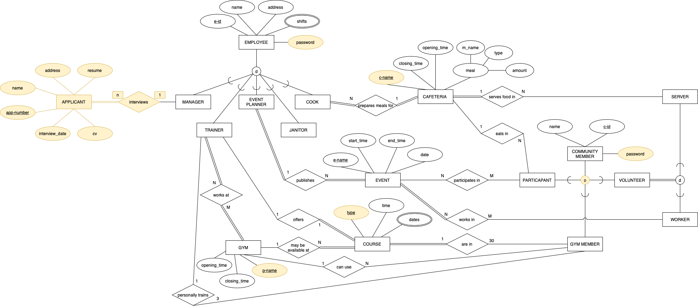

# Computer Engineering 138 Project
##  Members:
1. Ryan Biesty
2. Gianine Dao
3. Casey Delaney
4. Anmol Dhoor
5. Veronica Guardado-Munoz
6. Sabrina Lugo

## Description:
The purpose of this application is to create a community center that is able to provide the community with free and low cost services. It is intended to be used by the employees, volunteers, and community members to look up information regarding schedules, services, and events. 

## ERD Diagram

